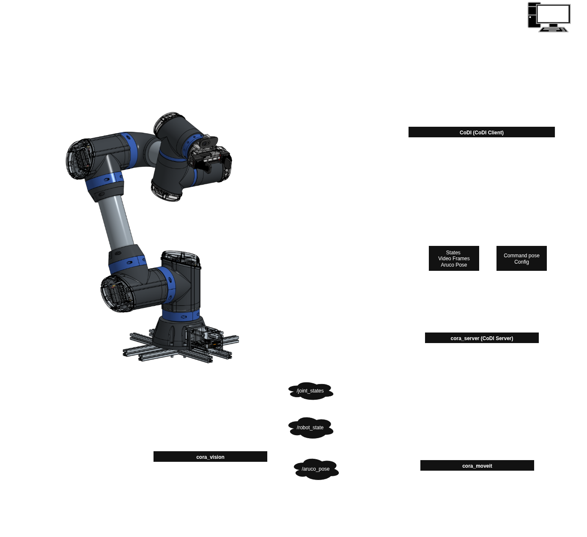

# CoDI (CORA Desktop Interface)


A Python SDK for communicating with the Cora robotic arms over TCP sockets.  
The package provides:

- `CoraClient` Running onn the client pc for straightforward control 
- `CoraServer` Running on a cora robot which interfaces with ROS  
- Utility functions for encoding commands and decoding robot state messages  

This SDK is designed to be simple, modular, and suitable for integration into larger robotics applications.

---

## Features

- TCP communication for commands, state feedback, and video
- Threaded background receivers
- Optional Tkinter GUI for monitoring and testing
- Command encoding and state decoding utilities

---
## Implementation Architecture



---

## Project Structure

```

src/
codi/
client.py
utils.py
exceptions.py
README.md
pyproject.toml

```

---

## Installation

### Linux 
>Make sure you have installed git otherwise the following commands will not work

Create a venv and source it:
```bash
python3 -m venv .venv\
source .venv/bin/activate
```

Install from github
```bash
pip install git+https://github.com/C-O-R-A/CoDI.git@main
```

Or install a specific release:

```bash
pip install git+https://github.com/C-O-R-A/CoDI.git@v0.1.0
```


Local installation (development)

```bash
git clone https://github.com/C-O-R-A/CoDI.git
cd codi
pip install -e .
```

### Windows

install globally from github
```bash
pip install git+https://github.com/C-O-R-A/CoDI.git@v0.1.0
```

---
## Setup

### Assign static IPs
>Before the client pc can connect to the robot, static ethernet ip's must be configured. 

#### Linux

##### 1. Create a new Netplan file if none exists already
```bash
sudo nano /etc/netplan/02-ethernet-static.yaml
```

Paste this exactly:
```yaml
network:
  version: 2
  renderer: NetworkManager
  ethernets:
    enx503eaa8b7587:
      dhcp4: no
      addresses:
        - 192.168.10.2/24
```

##### 2. Apply the new configuration
```bash
sudo netplan apply
```

Verify it worked

```bash
ip a show
```

You should now see:
```bash
inet 192.168.10.2/24 scope global <ethernet interface name>
```

#### Windows:

Navigate to your network settings, then ethernet, then to the ethernet adapter connected to the robot.
> Windows 10 often **requires a gateway and DNS** in the Settings app, even for a direct Ethernet link.

##### IPv4 Settings
- **IP address:** `192.168.10.2`
- **Subnet prefix length:** `24`
- **Default gateway:** `192.168.10.1`
- **Preferred DNS:** `1.1.1.1` (or `8.8.8.8`)

> The gateway/DNS are only to satisfy Windows — the PCs will still talk directly.

##### Steps (recommended / reliable way)
1. Press `Win`
2. Go to **Settings**
3. Click **Network & Internet**
4. Then **Ethernet**
5. Select the adapter corresponding to the robot
6. Scroll down to **IP settings** and click **Edit**
7. Set **IPv4** to **On** 
8. Enter:
   - IP address: `192.168.10.2`
   - Subnet prefix length: `24`
   - Gateway: `192.168.10.1`
   - Preferred DNS: `1.1.1.1`
9. Click **Save**

#### Test
Open Command Prompt and type:
```cmd
ping 192.168.10.1
```
or 
```cmd
ping cora.local
```

### Socket configuration files

This sdk supports both **.json** and **.yaml** config files. 
For most applications, the provided example config files under `./config/` can be copied and used.

#### Format:

**json**
```json
{
  "host": "cora.local",
  "video_port": <video port>,
  "command_port": <command port>,
  "states_port": <states port>,
  "config_port": <config port>,
  "vision_port": <vision port>
}
```

**yaml**
```yaml
host: "cora.local"
video_port: <video port>
command_port: <command port>
states_port: <states port>
config_port: <config port>
vision_port: <vision port>
```
---

## Dependencies

* `numpy`
* `opencv-python`
* `msgpack`
* `pyaml`

Both will be installed automatically when installing via `pip`.

---

## Basic Usage

**Client**
```python
import codi.api as cora

# Start the client using a config file
rt.start_client('client.json')
client = cora.get_client()

# Send joint position
cora.send_joint_position(
    rt=False,
    space="TS",
    interface_type="position",
    target="gripper",
    gripper_command=1.0,
    command=np.array([[1, 1, 1, 1], [2, 2, 2, 2]]),
    predef_pose="standby"
)
```
**Server**
```python
from codi import CoraServer

# Start the server
cora_srv = CoraServer(str(CONFIG))
cora_srv.start()

# Send state feedback
cora_srv.send_state('moving', 'joint',
                    end_effector_state=np.array([[1, 1, 1], [3, 3, 3]]),
                    camera_frame_state=np.array([[2, 2, 2], [4, 4, 4]]),
                    gripper_frame_state=np.array([[4, 4, 4], [5, 5, 5]]))
```
---

## Troubleshooting

* Ensure correct IP address and port configuration.
* GUI functions require a Python installation that includes Tkinter.
* Video display requires Pillow for image conversion.

---

## License

This project is released under the MIT License.

